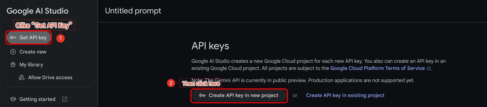

# Gemini Pro for macOS

This is a simple Python script powered by Google Gemini Pro API. You can have a conversation with Google Gemini Pro on your Mac through this script.

## Some prepares before using

### Google API Key

You should have your Google API Key before using. The script will ask your Google API Key for the first time. **Your Google API Key will only be saved on your own device.**

#### How to get your own Google API Key?

1. Open the website provided by Google: [ai.google.dev]("https://ai.google.dev/")
2. Clike the "Get API Key in Google AI Studio".
   

3. Get and copy your own Google API Key.
   

### A necessary package

You should install **google-generativeai** before running this script. You can install it by **pip install -r requirements.txt** or **pip install google-generativeai**

### Typora (recommended but not necessary)

To get the best experience, you can install Typora to display the responses from Gemini Pro. If Typora is available on your Mac, the script will run Typora automatically at the beginning of the dialogue between you and Gemini Pro.

**Typora is not necessary, you can also choose other apps which support Markdown to display the responses.**

**If you can develop Markdown parser or UI for this script, please contact me (2659029033@qq.com).**

## Quick start

1. Open the **Terminal** on your Mac.
2. Enter the project by **cd \<The project path\>**.
3. Use **python main.py** to run this script.

